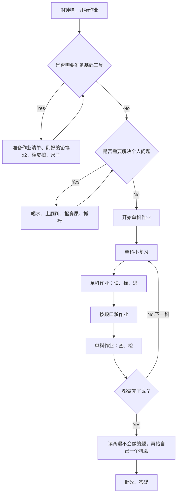

每日作业v1.0

## 基础作业约定
1. 闹铃一响，准时写作业
2. 准备基础工具：今日作业清单、削好的铅笔 * 2、橡皮擦、尺子
3. 全部解决个人问题：喝水、上厕所、抠鼻屎、抓痒问题
4. 单科作业之前要”小复习“
5. 要求：顺口溜
-- 落笔之前要读题、不漏字来要标记
-- 横平竖直不出格、转折顿挫不出头
-- 间隔适中不拥挤、用力擦除没痕迹
-- 难题不会反复读、没有把握标星星
-- 坐姿端正不趴下、做完检查等答疑
6. 不会做的留下来做下一个，并记录在当日草稿纸上
7. 作业完成后，整理书桌，东西归位，台灯关闭
8. 做完所有作业，对照草稿纸上的”不会清单“，再次读题，要读出声，思考一下，确定不会做再晚上找妈妈爸爸答疑
9. 所有作业完成后，爸爸妈妈批改，统一针对不会做和做错的答疑

## 每日打卡
### 打鼓
1. 打鼓当周曲亩 > 5次
2. 要求速度是原速，或比上一日快10，正确率100%或比上一日高1%以上
### 阅读打卡
1. 至少两段，使用爸爸的游戏手机，密码相同
2. 不会的字划线（当晚爸爸妈妈会抽查，如果胡乱读，当日重读两段）
### 英语打卡
1. 听录音一次
2. 跟读一次（使用复读机的跟读功能）
### Anki打卡
无

## 数学题约定
1. 读：仔细读题，不明白的读两遍，不漏字，不加字
2. 标：标出题目中的关键词，有图片的结合图片想问题
3. 思：认真思考，若需要草稿纸可先在草稿纸上进行联系（草稿纸由上到下使用，单日草稿纸晚上复习会用）
4. 查：做完后要进行书面见啥，避免漏题，避免书写错误，避免抄写错误
5. 检：做的过程中对于不自信的题目，在序号上标五角星，全部做完之后复算五角星题目

## 阅读约定
1. 指读：指读文章，保证不漏字，不加字，不跳行
2. 大声朗读，速度慢一点，嘴巴张开，吐字清楚
3. 分享：简单总结今日朗读的时间(when)，地点(where)，人物(who)，事情(what)，中文用中文，英语用英语(英语可以让爸爸妈妈提示)

